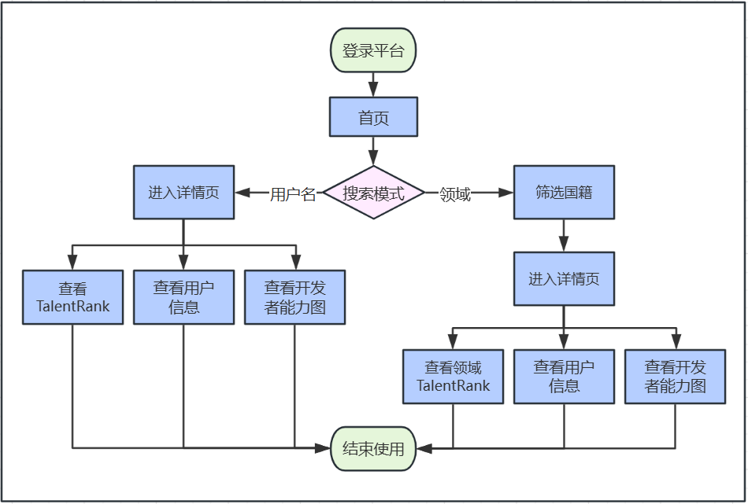
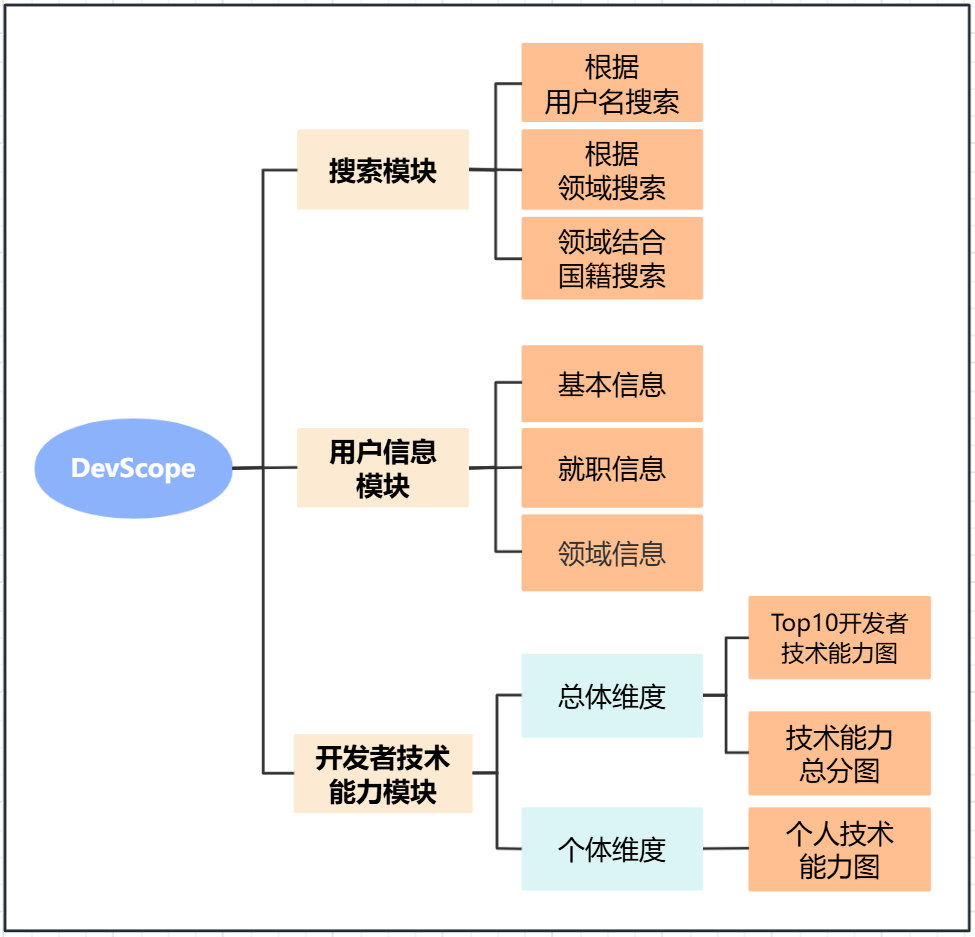
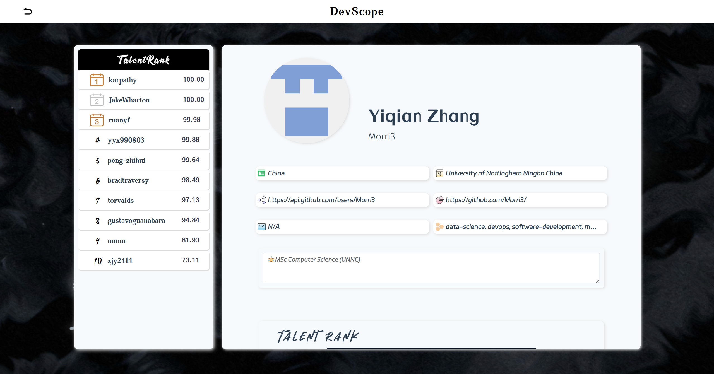
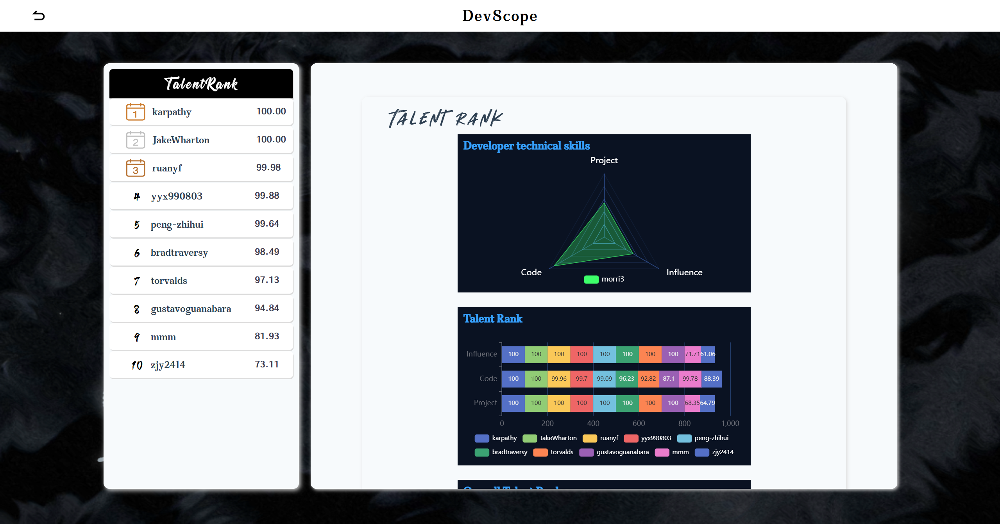
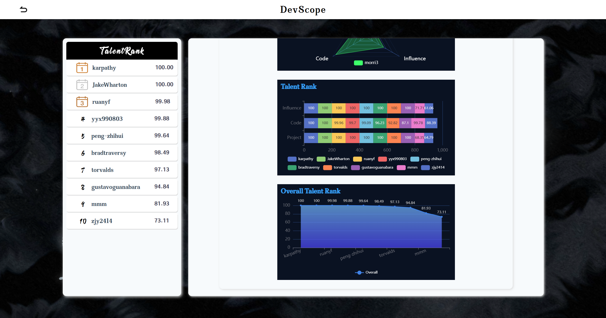
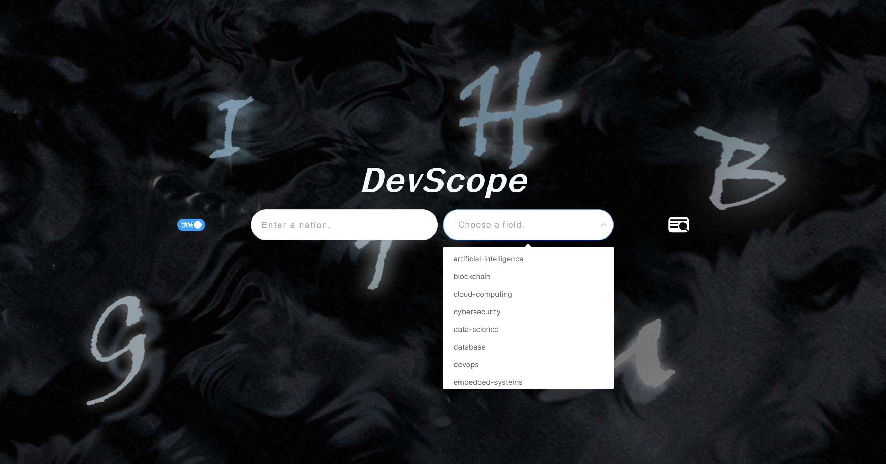
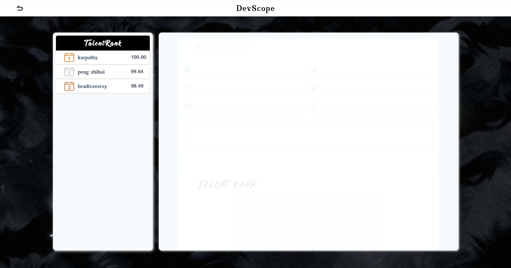
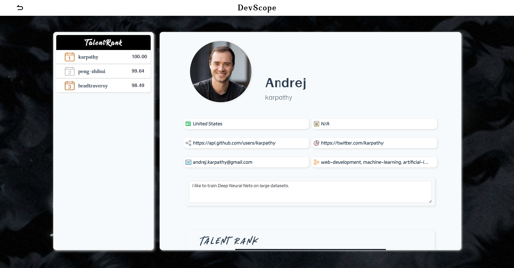
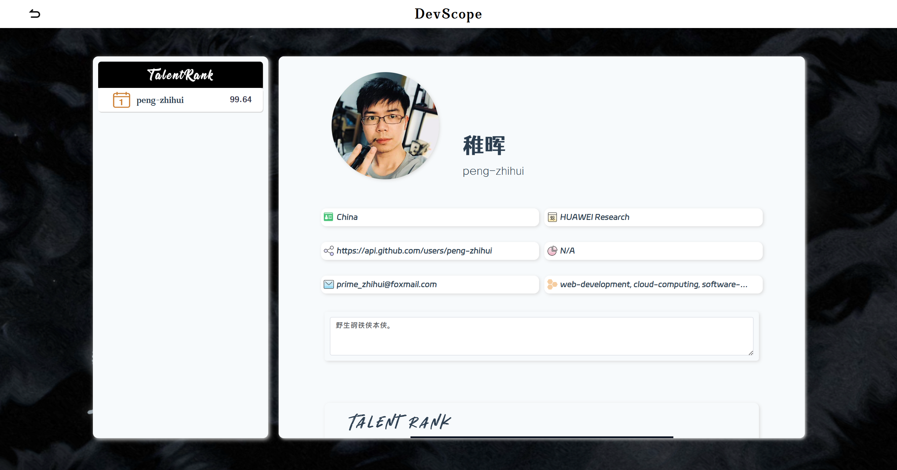

# DevScope

DevScope是一个基于 Vue3.js + TypeScript 的前端框架，用于提供 DevScope 的前端界面和用户交互。<br>

## 模块介绍

### 1. 首页
首页，由 **项目标题**“DevScope” 、 **搜索区域** 、 **搜索模式切换按钮** 以及 **搜索图标** 组成。<br>
用户初次进入网页，即可看到普通模式。以下为两种搜索模式的搜索流程：<br>

#### 1. 普通模式（根据用户名搜索）
step1 · 用户在输入框中输入用户名后，点击右侧的搜索图标，前端调用后端api接口，获取该用户的信息，包括基本信息、就职信息（即公司名称）；<br>
step2 · 同时，对这些信息进行预处理（将空信息设置为“N/A”）、封装和填充；<br>
step3 · 随后，跳转到列表详情页。<br>

#### 2. 领域模式（根据领域搜索）
step1 · 当用户点击 switch 开关，切换为领域模式后，用户在下拉框中选择需要查询的领域，（在输入框中输入想要筛选的国籍，这一步可选，）点击右侧的搜索图标，前端调用后端api接口，获取指定领域的所有用户排名<sup>1</sup>；<br>
step2 · 若有选择国籍，则从<sup>1</sup>的返回结果中筛选指定国籍的用户；<br>
step3 · 同时，对这些信息进行预处理（将空信息设置为“N/A”）、封装和填充；<br>
step4 · 随后，跳转到列表详情页。<br>

### 2. 列表详情页
#### 1. 页面组成
页面由列表、具体信息的左右两栏布局实现。<br>
其中，左侧的列表部分，存放两种搜索模式搜索到的用户排名表，包含各用户的 **排名** 、 **用户名** 、 **开发者技术能力总分** 。<br>
右侧的具体信息部分，分为 **基本信息** 、 **Talent Rank 图表** 。两部分内容如功能模块图所示。<br>

#### 2. 前端实现
在OnBeforeMount生命周期中，根据存储在状态管理存储store中的模式字段，分别执行普通模式搜索、领域模式搜索。<br>

```
if (searchStore.getSearchMode()) { // 领域模式
  // 根据领域的talentRankList的第一个元素的username，搜索该用户的基本信息
  selectUser((userStore.getTalentRankList())[0])
} else { // 普通模式
  const user = allocateMember(JSON.parse(userStore.getUserInfo()))
  refreshUserInfo(user.login)
}
```

其中，selectUser()函数将调用refreshUserInfo()。在refreshUserInfo()中，先后调用api获取用户的信息（包含领域信息）。最后，通过布尔类型的字段state.reRendering的切换，实现echarts的数据动态渲染。<br>

```
state.reRendering = false
nextTick(() => {
  state.reRendering = true
})
```

当用户在列表详情页，点击其他用户时，会调用refreshUserInfo()函数执行上述操作，将用户信息存储到变量中，并将数据展示在页面中。<br>
对于Echarts展示的图表，是通过将每个类型的图表各自封装为一个组件来实现，这样可以极大改善代码的易读性。<br>


## 项目所使用技术
项目使用了如下技术、框架：<br>
1. Vite（搭建初始化项目）
2. Vue3.js + TypeScript（包括TypeScript的interface（对象接口））<br>
3. Axios（经过封装，用于前后端数据通信）<br>
4. Element-plus（UI组件库）<br>
5. Pinia（实现数据存储）<br>
6. Echarts（图表的数据展示）<br>

## 相关图表

### 1. 系统流程图

<p align="center">
  
</p>


### 2. 功能模块图

<p align="center">
  
</p>

### 3. 界面效果图
<p align="center">
  <div>1. 普通模式搜索的效果如下所示：</div>
  
  
  
  
  <div>2. 领域模式搜索的效果如下所示：</div>
  
  
  
  
  
</p>


# 如何使用项目

请参照以下内容使用该项目。<br>

## 1. 推荐的IDE Setup

[VSCode](https://code.visualstudio.com/) + [Volar](https://marketplace.visualstudio.com/items?itemName=Vue.volar) (and disable Vetur).

## 2. 项目搭建

```sh
npm install
```

### 1. 编译和热加载

```sh
npm run dev
```

### 2. （可选）生产环境下的类型检查、编译和压缩

```sh
npm run build
```
